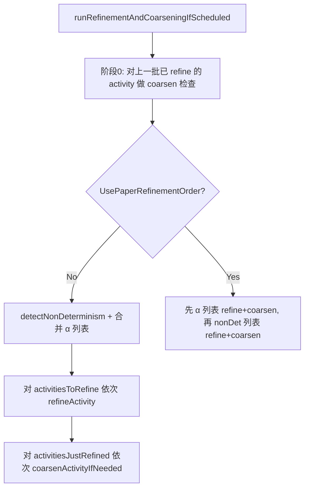
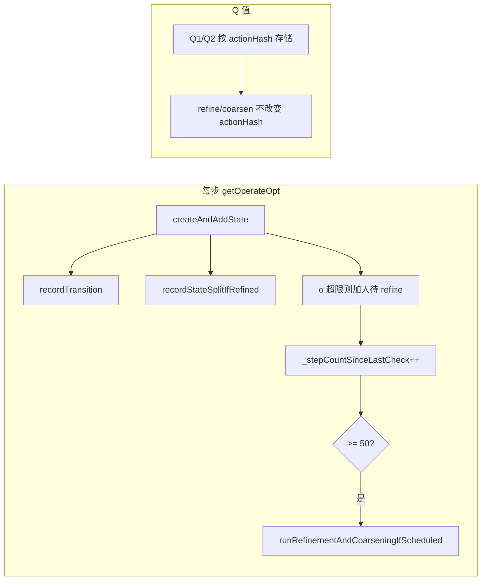

/**
 * @authors Zhao Zhang
 */

# State 抽象技术档案

本文基于当前 Fastbot Native 实现，说明动态 State 抽象的含义、维度、初始配置、细化/聚合时机及 Q 值保存方式。

---

## 1. 什么是 State 抽象

**State 抽象**指用**部分 widget 属性**决定“当前界面是否算同一个状态”：只把选中的属性参与 hash，其它属性忽略。同一 Activity 下，**抽象粗**时多个不同 GUI 会合并成同一个 state；**抽象细**时同一 GUI 可能被拆成多个 state。

- **作用**：在“状态数爆炸”和“区分度不足”之间做折中；配合 **refine（细化）** 与 **coarsen（聚合）** 动态调整。
- **粒度单位**：按 **Activity** 维护一个 **WidgetKeyMask**（位掩码），该 Activity 下所有 state 的 hash 都用同一 mask 计算。
- **实现位置**：`ReuseState::buildHashForState()` 用 `_widgetKeyMask` 调用 `widget->hashWithMask(mask)`；`Model::_activityKeyMask[activity]` 存每个 activity 的 mask。

---

## 2. 抽象维度（WidgetKeyAttr）

State 的等价类由 **Widget 的若干属性** 参与 hash 决定，这些属性即“抽象维度”。由位掩码 **WidgetKeyMask**（`uint8_t`）选择参与维度。

| 维度 | 枚举名 | 位 | 说明 |
|------|--------|-----|------|
| Clazz | WidgetKeyAttr::Clazz | 1<<0 | 控件类名 |
| ResourceID | WidgetKeyAttr::ResourceID | 1<<1 | 资源 ID |
| OperateMask | WidgetKeyAttr::OperateMask | 1<<2 | 可执行操作（点击/长按等） |
| ScrollType | WidgetKeyAttr::ScrollType | 1<<3 | 是否可滚动 |
| Text | WidgetKeyAttr::Text | 1<<4 | 文本内容 |
| ContentDesc | WidgetKeyAttr::ContentDesc | 1<<5 | 内容描述 |
| Index | WidgetKeyAttr::Index | 1<<6 | 在兄弟中的索引 |

- **实现**：`Base.h` 中 `WidgetKeyAttr` 与 `WidgetKeyMask`；`Widget::hashWithMask(mask)` 按 mask 位组合各维度预计算好的分量 hash（`_hashClazz`、`_hashText` 等）。
- **State hash**：`activityHash ^ (widgetsHash << 1)`，其中 `widgetsHash` 由该 state 内所有 widget 的 `hashWithMask(mask)` 异或得到。

---

## 3. 初始维度（DefaultWidgetKeyMask）

**初始 mask** 只包含 4 个维度（较粗），不包含 Text / ContentDesc / Index：

```text
DefaultWidgetKeyMask = Clazz | ResourceID | OperateMask | ScrollType
```

- **含义**：新 Activity 首次建 state 时，若 `_activityKeyMask` 中无该 activity，则使用 `DefaultWidgetKeyMask`（见 `Model::getActivityKeyMask()`）。
- **目的**：先粗粒度合并，减少状态数；后续由 refine 按需加 ContentDesc → Index → Text。

---

## 4. 何时做抽象细化（Refine）

### 4.1 触发来源

细化在**每 K 步的批处理**里做，触发来源有两类（可合并）：

1. **非确定性（State Refinement）**  
   同一 (sourceStateHash, actionHash) 在 transition log 里对应 **≥ MinNonDeterminismCount（2）个不同 targetStateHash**，则认为该 source 所在 activity 需要更细的 state 区分，加入待 refine 列表。
2. **α 触发（Action Refinement）**  
   某步若当前 state 的 `getMaxWidgetsPerModelAction() > AlphaMaxGuiActionsPerModelAction（3）`，即“同一 model action 对应过多 GUI 控件”，则把该 activity 加入 `_activitiesNeedingAlphaRefinement`，本批合并进待 refine 列表。

### 4.2 执行时机与周期

- **周期**：每执行 **RefinementCheckInterval（50）** 步 `getOperateOpt` 后，调用一次 `runRefinementAndCoarseningIfScheduled()`，在**该批内**先做 coarsen 检查，再做 refine。
- **顺序**（默认 `UsePaperRefinementOrder == 0`）：  
  1）先对“上一批已 refine、已积累 split 数据”的 activity 做 **coarsen 检查**；  
  2）`detectNonDeterminism()` + 合并 `_activitiesNeedingAlphaRefinement` 得到 `activitiesToRefine`；  
  3）对 `activitiesToRefine` 中每个 activity 调用 `refineActivity(activity)`；  
  4）对本次 **refine 成功** 的 activity 再调用一次 `coarsenActivityIfNeeded`（本批内 split 数据为空，仅占位）。

### 4.3 细化规则（每 activity 每批至多加一维）

- **加维顺序**：ContentDesc → Index → Text（当前实现固定顺序）。
- **约束**：  
  - 若已是最细 mask（含 Clazz|ResourceID|OperateMask|ScrollType|Text|ContentDesc|Index），则不再 refine。  
  - 若候选 newMask 在黑名单 `_coarseningBlacklist` 中，则跳过。  
  - 加 **Text** 前会检查“文本过多/爆炸”保护：  
    - 非空 text 的 widget 数 > MaxTextWidgetCount（20），或  
    - 占比 > MaxTextWidgetRatioPercent（50%），或  
    - 若加 Text 后唯一 widget 数 > MaxUniqueWidgetsAfterText（50）  
    则本步不加 Text，refine 失败。
- **副作用**：refine 成功时 `ctx.previousMask = cur`，`ctx.oldStateToNewStates.clear()`，`setActivityKeyMask(activity, newMask)`，便于后续 `recordStateSplitIfRefined` 统计“上一版 L′ 被当前 L 拆成多少新 state”。

---

## 5. 何时做抽象聚合（Coarsen）

### 5.1 触发条件（APE 语义）

对**已经 refine 过、且当前 mask 比 previousMask 更细**的 activity，在**本批开始**时用过去 K 步积累的 split 数据做检查：

- **数据**：`_activityAbstractionContext[activity].oldStateToNewStates`  
  - 键：`oldHash = state->getHashUnderMask(previousMask)`（上一版 mask L′ 下的状态）  
  - 值：该 oldHash 在**当前 mask L** 下对应的不同 `state->hash()` 的集合。
- **条件**：若存在某个 oldHash 对应的集合 **size > BetaMaxSplitCount（8）**，即“L′ 下一个状态被 L 拆成超过 8 个新状态”，则执行 **coarsen**。

### 5.2 执行时机

- **时机 1（主要）**：每 K 步 batch **开头**，对 `_activityAbstractionContext` 中所有满足 `ctx.previousMask != getActivityKeyMask(activity)` 的 activity 调用 `coarsenActivityIfNeeded(activity)`，此时 `oldStateToNewStates` 已由过去 K 步的 `recordStateSplitIfRefined` 填好。
- **时机 2**：本批内对**本批刚 refine 成功**的 activity 再调用一次 `coarsenActivityIfNeeded`（此时 split 刚被清空，相当于 no-op，保持接口一致）。

### 5.3 聚合动作

- `setActivityKeyMask(activity, prev)`：mask 回退到上一版 L′。  
- `_coarseningBlacklist.insert((activity, cur))`：当前细 mask 加入黑名单，避免再次 refine 到同一 mask。  
- `ctx.oldStateToNewStates.clear()`，并更新 `stateCountAtLastRefinement`。  
- 回退后 `ctx.previousMask == getActivityKeyMask(activity)`，后续 `recordStateSplitIfRefined` 不再写入，语义正确。

---

## 6. 细化/聚合时如何保存 Q 值

- **Q 表键**：当前实现（DoubleSarsaAgent）中，Q 值按 **action hash** 存储：`_reuseQValue1[actionHash]`、`_reuseQValue2[actionHash]`。Action hash 由 **widget + action 类型** 等决定，与 **state 抽象维度（mask）** 无关。
- **State 抽象只影响**：  
  - 哪些 GUI 被算作**同一个 state**（进而影响 graph 中 state 节点、访问统计、transition 记录）；  
  - **不改变** action 的标识，也不改变 Q 表的 key。
- **因此**：  
  - **Refine**：只是 state 变细、同一 activity 下 state 数变多；同一 GUI 上的同一操作仍是同一 action、同一 actionHash，Q 表无需迁移，**Q 值自然保留**。  
  - **Coarsen**：mask 变粗，部分 state 再次合并；action 仍按 action hash 索引，**Q 值同样保留**。  
- **结论**：无需在 refine/coarsen 时做 Q 值迁移或合并；Q 值按 action 维度保存，与 state 抽象维度解耦。

---

## 7. 流程图

### 7.1 每步 getOperateOpt 与 State 抽象相关流程

```text
┌─────────────────────────────────────────────────────────────────────────┐
│                        getOperateOpt(descContent, activity, deviceID)   │
└─────────────────────────────────────────────────────────────────────────┘
                                      │
                                      ▼
┌─────────────────────────────────────────────────────────────────────────┐
│  createAndAddState(element, agent, activityPtr)                         │
│  · mask = getActivityKeyMask(activity)  // 当前 activity 的抽象维度     │
│  · StateFactory::createState(..., mask)                                 │
│  · ReuseState 内: buildHashForState() 用 mask 算 state hash              │
└─────────────────────────────────────────────────────────────────────────┘
                                      │
                    ┌─────────────────┴─────────────────┐
                    │ DYNAMIC_STATE_ABSTRACTION_ENABLED? │
                    └─────────────────┬─────────────────┘
                                      │ Yes
         ┌────────────────────────────┼────────────────────────────┐
         ▼                            ▼                            ▼
┌─────────────────┐    ┌─────────────────────────────┐   ┌─────────────────────┐
│ recordTransition│    │ recordStateSplitIfRefined   │   │ 若 getMaxWidgetsPer  │
│ (src, act, tgt) │    │ (activity, state)           │   │ ModelAction() > α    │
│ 写入 transition │    │ 若 ctx.previousMask != cur   │   │ → 加入 _activities   │
│ log             │    │ 则 oldStateToNewStates      │   │ NeedingAlphaRefine   │
└─────────────────┘    │ [oldHash].insert(newHash)   │   └─────────────────────┘
                       └─────────────────────────────┘
                                      │
                                      ▼
┌─────────────────────────────────────────────────────────────────────────┐
│  _stepCountSinceLastCheck++                                             │
│  若 _stepCountSinceLastCheck >= RefinementCheckInterval(50)             │
│    → runRefinementAndCoarseningIfScheduled(); _stepCountSinceLastCheck=0 │
└─────────────────────────────────────────────────────────────────────────┘
```

### 7.2 每 K 步批处理 runRefinementAndCoarseningIfScheduled 总览

```text
┌─────────────────────────────────────────────────────────────────────────┐
│            runRefinementAndCoarseningIfScheduled()                       │
│            (每 RefinementCheckInterval 步调用)                           │
└─────────────────────────────────────────────────────────────────────────┘
                                      │
                                      ▼
┌─────────────────────────────────────────────────────────────────────────┐
│  阶段 0：对“上一批已 refine”的 activity 做 coarsen 检查                   │
│  for (activity, ctx) in _activityAbstractionContext:                     │
│    if ctx.previousMask != getActivityKeyMask(activity):                  │
│      coarsenActivityIfNeeded(activity)  // 用过去 K 步的 split 数据       │
└─────────────────────────────────────────────────────────────────────────┘
                                      │
                                      ▼
                    ┌─────────────────────────────────┐
                    │ UsePaperRefinementOrder ?        │
                    └─────────────┬───────────────────┘
                         No       │       Yes
              ┌───────────────────┼───────────────────┐
              ▼                   │                   ▼
┌─────────────────────────────┐   │   ┌─────────────────────────────────┐
│ 合并待 refine 列表：         │   │   │ 先对 α 列表 refine+coarsen        │
│ · activitiesToRefine =      │   │   │ 再对 nonDet 列表 refine+coarsen  │
│   detectNonDeterminism()    │   │   └─────────────────────────────────┘
│ · 合并 _activitiesNeeding  │   │
│   AlphaRefinement，去重     │   │
└─────────────────────────────┘   │
              │                   │
              ▼                   │
┌─────────────────────────────┐   │
│ for activity in             │   │
│   activitiesToRefine:       │   │
│   if refineActivity(activity)   │
│     activitiesJustRefined   │   │
│       .push_back(activity)  │   │
└─────────────────────────────┘   │
              │                   │
              ▼                   │
┌─────────────────────────────┐   │
│ for activity in             │   │
│   activitiesJustRefined:    │   │
│   coarsenActivityIfNeeded   │   │
│   (activity)  // 本批数据空 │   │
└─────────────────────────────┘   │
```

### 7.3 Refine 单 activity 流程（refineActivity）

```text
┌─────────────────────────────────────────────────────────────────────────┐
│                        refineActivity(activity)                          │
└─────────────────────────────────────────────────────────────────────────┘
                                      │
                                      ▼
┌─────────────────────────────────────────────────────────────────────────┐
│  cur = getActivityKeyMask(activity)                                      │
│  按顺序尝试加一维: ContentDesc → Index → Text                            │
└─────────────────────────────────────────────────────────────────────────┘
                                      │
         ┌────────────────────────────┼────────────────────────────┐
         ▼                            ▼                            ▼
┌─────────────────┐    ┌─────────────────────────────┐   ┌─────────────────────┐
│ (cur & cMask)==0│    │ (cur & iMask)==0            │   │ (cur & tMask)==0   │
│ → newMask=cur   │    │ → newMask=cur|iMask         │   │ → newMask=cur|tMask│
│   |cMask        │    │ (+Index)                    │   │ (+Text)            │
│ (+ContentDesc)  │    │ 无额外保护                   │   │ 需通过 Text 保护    │
└────────┬────────┘    └──────────────┬──────────────┘   │ (textCount/ratio/  │
         │                           │                  │  uniqueAfterText)  │
         │                           │                  └──────────┬─────────┘
         │                           │                             │
         └───────────────────────────┼─────────────────────────────┘
                                    │
                                    ▼
┌─────────────────────────────────────────────────────────────────────────┐
│  若已最细 (无维可加) → return false; 若 (activity, newMask) 在黑名单 →  │
│  return false                                                           │
└─────────────────────────────────────────────────────────────────────────┘
                                    │ 通过
                                    ▼
┌─────────────────────────────────────────────────────────────────────────┐
│  ctx.previousMask = cur; ctx.oldStateToNewStates.clear();                │
│  setActivityKeyMask(activity, newMask);                                 │
│  return true                                                             │
└─────────────────────────────────────────────────────────────────────────┘
```

### 7.4 Coarsen 单 activity 流程（coarsenActivityIfNeeded）

```text
┌─────────────────────────────────────────────────────────────────────────┐
│                   coarsenActivityIfNeeded(activity)                      │
└─────────────────────────────────────────────────────────────────────────┘
                                      │
                                      ▼
┌─────────────────────────────────────────────────────────────────────────┐
│  若 _activityAbstractionContext 无该 activity → return                  │
└─────────────────────────────────────────────────────────────────────────┘
                                      │ 有
                                      ▼
┌─────────────────────────────────────────────────────────────────────────┐
│  遍历 ctx.oldStateToNewStates:                                          │
│  (oldHash → set of newHash)                                             │
└─────────────────────────────────────────────────────────────────────────┘
                                      │
                      ┌───────────────┴───────────────┐
                      ▼                               ▼
            ┌─────────────────────┐         ┌─────────────────────┐
            │ 存在某 oldHash 对应  │         │ 全部 ≤ β            │
            │ set.size() > β(8)   │         │ → return，不回退     │
            └──────────┬──────────┘         └─────────────────────┘
                       │
                       ▼
┌─────────────────────────────────────────────────────────────────────────┐
│  setActivityKeyMask(activity, prev);  // 回退到 previousMask             │
│  _coarseningBlacklist.insert((activity, cur));                           │
│  ctx.oldStateToNewStates.clear(); 更新 stateCountAtLastRefinement        │
│  BLOG("state abstraction: coarsen ...")                                 │
└─────────────────────────────────────────────────────────────────────────┘
```

### 7.5 Split 数据积累（recordStateSplitIfRefined）与 Q 值关系

```text
┌─────────────────────────────────────────────────────────────────────────┐
│  每步 createAndAddState 后: recordStateSplitIfRefined(activity, state)    │
└─────────────────────────────────────────────────────────────────────────┘
                                      │
                                      ▼
┌─────────────────────────────────────────────────────────────────────────┐
│  有 context 且 ctx.previousMask != cur (已 refine 且未 coarsen) ?         │
└─────────────────────────────────────────────────────────────────────────┘
                                      │ Yes
                                      ▼
┌─────────────────────────────────────────────────────────────────────────┐
│  oldHash = state->getHashUnderMask(ctx.previousMask);  // L′ 下           │
│  newHash = state->hash();                              // L 下           │
│  ctx.oldStateToNewStates[oldHash].insert(newHash);                      │
└─────────────────────────────────────────────────────────────────────────┘

                    ┌────────────────────────────────────┐
                    │  Q 值: 按 actionHash 存于 Agent    │
                    │  State 抽象只改 state hash / mask  │
                    │  不改 action 标识 → Q 无需迁移     │
                    └────────────────────────────────────┘
```

---

## 8. 相关常量与代码位置汇总

| 项 | 常量/名称 | 默认值 | 位置 |
|----|-----------|--------|------|
| 批处理间隔 | RefinementCheckInterval | 50 | utils.hpp |
| 非确定性阈值 | MinNonDeterminismCount | 2 | utils.hpp |
| 聚合阈值 β | BetaMaxSplitCount | 8 | utils.hpp |
| α 触发阈值 | AlphaMaxGuiActionsPerModelAction | 3 | utils.hpp |
| Text 保护 | MaxTextWidgetCount / MaxTextWidgetRatioPercent / MaxUniqueWidgetsAfterText | 20 / 50 / 50 | utils.hpp |
| 初始 mask | DefaultWidgetKeyMask | Clazz\|ResourceID\|OperateMask\|ScrollType | Base.h |
| 维度定义 | WidgetKeyAttr | 7 维 | Base.h |
| State hash 与 mask | ReuseState::buildHashForState, getHashUnderMask | - | ReuseState.cpp |
| Widget hash 与 mask | Widget::hashWithMask | - | Widget.cpp |
| Refine/Coarsen 逻辑 | refineActivity, coarsenActivityIfNeeded, runRefinementAndCoarseningIfScheduled | - | Model.cpp |
| Split 记录 | recordStateSplitIfRefined | - | Model.cpp |
| Q 存储 | _reuseQValue1/2[actionHash] | - | DoubleSarsaAgent |

---

## 9. Mermaid 流程图（可选渲染）

### 9.1 每 K 步批处理总览



### 9.2 Refine 单 activity 决策

```mermaid
flowchart TD
    A[refineActivity] --> B[cur = getActivityKeyMask]
    B --> C{可加 ContentDesc?}
    C -->|是| D[newMask = cur | ContentDesc]
    C -->|否| E{可加 Index?}
    E -->|是| F[newMask = cur | Index]
    E -->|否| G{可加 Text?}
    G -->|是| H[通过 Text 保护检查?]
    H -->|是| I[newMask = cur | Text]
    H -->|否| J[return false]
    G -->|否| K[已最细 mask, return false]
    D --> L{黑名单?}
    F --> L
    I --> L
    L -->|否| M[写 context, setActivityKeyMask, return true]
    L -->|是| N[return false]
```

### 9.3 Coarsen 判定与执行

```mermaid
flowchart TD
    A[coarsenActivityIfNeeded] --> B{有 context?}
    B -->|否| C[return]
    B -->|是| D[遍历 oldStateToNewStates]
    D --> E{存在 oldHash 对应 set.size > β?}
    E -->|否| C
    E -->|是| F[setActivityKeyMask 回退到 prev]
    F --> G[黑名单加入 (activity, cur)]
    G --> H[清空 oldStateToNewStates]
```

### 9.4 每步与 State 抽象相关的数据流



---
